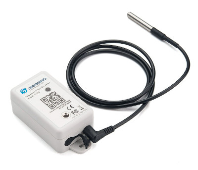
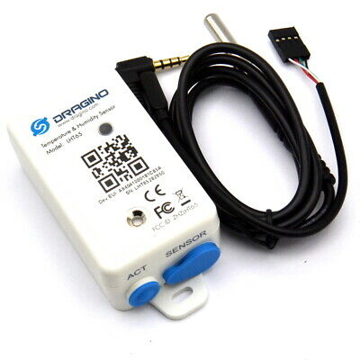
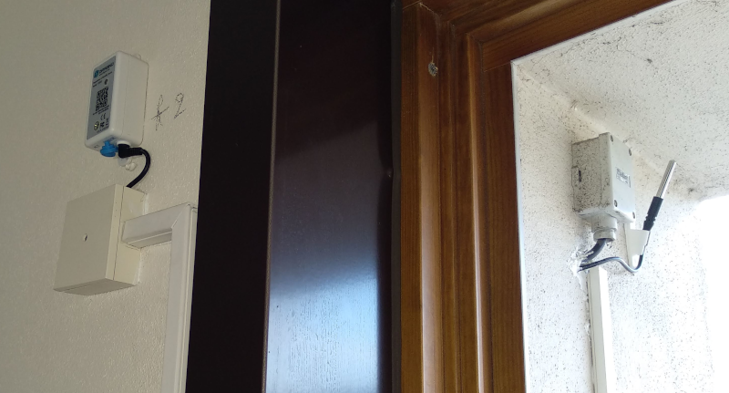

El Dispositivo que vamos vamos a conectar a nuestro sistema IOT, es un Nodo de temperatura y humedad. Para evitar complicaciones en la curva de aprendizaje vamos a usar un Nodo comercial y robusto llamado [Dragino LTH65](https://www.dragino.com/products/lora-lorawan-end-node/item/151-lht65.html). 

En concreto este Nodo de la casa Dragino se denomina LHT65-EU868-E1. Este sensor trabaja en la banda ISM (Industria, Ciencia y Médico) en la frecuencia 868Mhz que es gratuita y sin autorización. Además del sensor de temperatura que está integrado en su propia caja, la denominación E1 hace referencia a un segundo sensor externo mediante una sonda del tipo DS18b20. Los datos más destacables del sensor que hemos seleccionado son:

- Tiene una carcasa robusta, simple y fácil de manipular
- Es compatible con el protocolo LoRaWAN v1.0.2 por lo que puede trabajar con gateways LoRaWAN estandars.
- Es un sensor barato, alrededor de 30 euros
- Gracias a una batería no recargable de 2400mAh, puede durar más de 10 años.
- Tiene un único botón (ACT) mediante el cual podemos establecer ciertos modos de trabajo (encender, apagar y resetearlo). 
- Mediante un segundo sensor de temperatura externo que se conecta mediante un minijack que evita fallos en la conexión.
- Tiene un led tricolor para poder indicar el modo de trabajo en el que está.
- Viene configurado para envía datos cada 20 minutos

El LTH65 predefinidamente está en modo sueño profundo y mediante el botón ACT cambiará de estado

| Actuación sobre ACT             | Función                  | Acción                                                       |
| ------------------------------- | ------------------------ | ------------------------------------------------------------ |
| Pulsar ACT más que 3 segundos   | El dispositivo se activa | A los 3 segundos el led verde parpadea 5 veces, el dispositivo se activa y empieza a emparejarse con la red LORAWAN parpadeará en rojo hasta que se conecte. Se encenderá azul y luego se mantendrá 5 segundos en verde para indicar que se ha emparejado correctamente. Predefinidamente envía cada 20 minutos una lectura al gateway. |
| Pulsar ACT entre 1 y 3 segundos | Sube un dato             | El sensor envía una lectura al gateway y parpadea el led azul. |
| Pulsar ACT 5 veces rápido       | Desactiva el dispositivo | El led rojo permanecerá encendido 5 segundos, significando que el sensor a entrado en modo sueño profundo. |

En los siguientes videos se muestran distintos usos del sensor:

- [Unboxing](https://youtu.be/1C1ANLAbWzg)
- [Puesta en marcha](https://youtu.be/Y9QZJgWkvLc)
- [Ejemplo de instalación y puesta en marcha](https://youtu.be/-Vjq4xWqLTw)

Instalación del sensor LTH65 para medir una estancia y la sonda E1 en el exterior del edificio.

