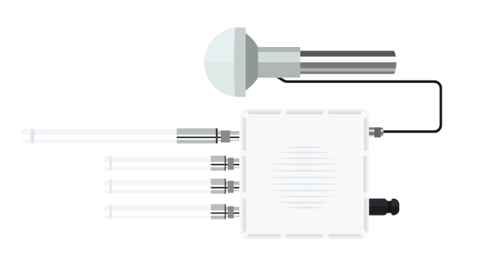
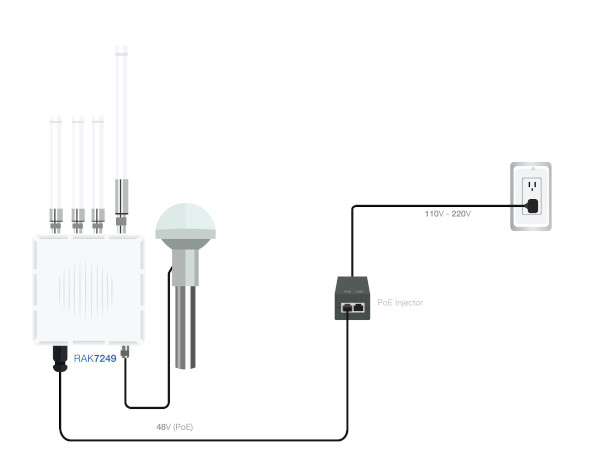
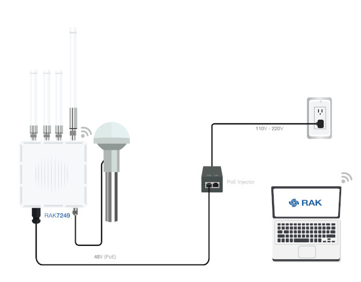
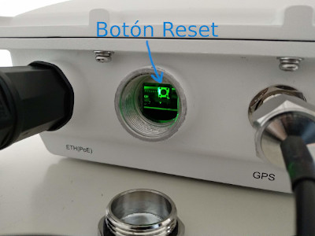
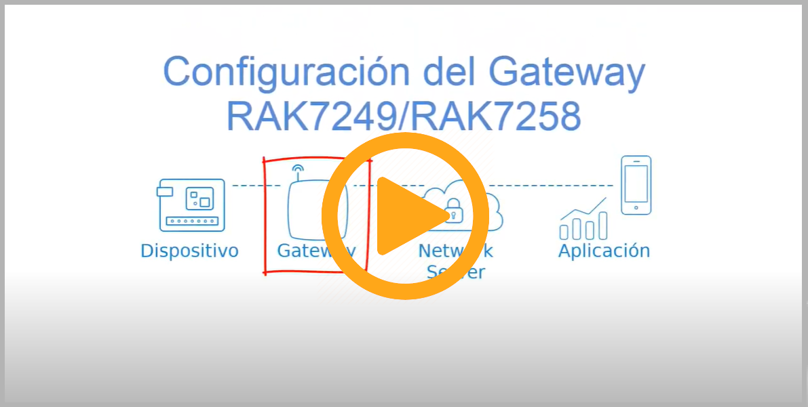
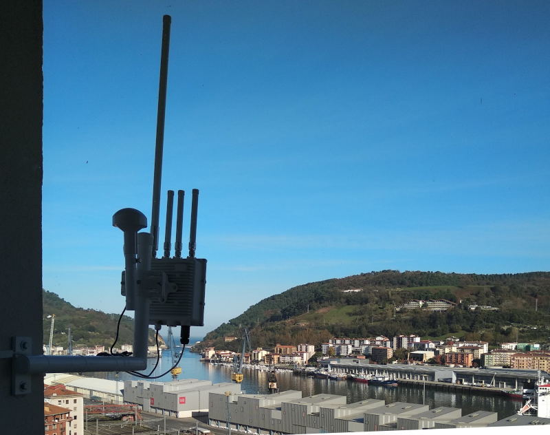

El Gateway que vamos a usar es un [RAK7249](https://docs.rakwireless.com/Product-Categories/WisGate/RAK7249/Overview/#product-description) que es una puerta de enlace diseñada para poder conectarse con múltiples Nodos LoRa y transmitir los datos por internet a los servidores o Network Server. 

El Gateway puede venir con los siguientes elementos y características:

- Antena LoRa de 3dB o 5dBs para aumentar la distancia a la que puede comunicarse con los Nodos.
- Antena WiFi de 2.4GHz para poder acceder a la configuración del Gateway de manera sencilla.
- Conector RJ45 para conectar a la LAN y usar la salida de internet
- Antena LTE con conector de tarjeta SIM para poder conectar con internet a 4G
- Antena GPS para geolocalizar el Gateway
- Alimentado mediante inyector POE
- Carcasa metálica con protección IP67 para exteriores con abrazadera para amarrarlo a un mástil.

La puesta en marcha está documentada en la [Quick Start Guide](https://docs.rakwireless.com/Product-Categories/WisGate/RAK7249/Quickstart) pero al ser varios los pasos que hay que dar vamos a comentar los más importantes:

- Conexión interna del gateway, nos vino montada pero nunca viene mal ver un [video del montaje](https://www.youtube.com/watch?v=59JUvPa6t20).
- En caso de tener que abrir la tapa del gateway es importante [tener en cuenta este truco](https://www.youtube.com/watch?v=kZi5uDqWUBg)
- IMPORTANTE: **NO ALIMENTAR EL GATEWAY HASTA QUE TODAS LAS ANTENAS ESTÉN CONECTAS (LTE, WIFI, LORA Y GPS)** puede quemarse algún circuito. 

1. Conectar todas las antenas de WiFi, LoRa, LTE-DIV, LTE-MAIN y GPS a la caja del RAK7249.

2. Conectar mediante un cable de red, el RJ45 del Gateway con la boca POE del Inyector POE y así mismo alimentar el Inyector POE.

   

3. El gateway creará una red WiFi, con el SSID parecida a RAK7249_XXXX siendo las XXXX los 4 dígitos de la izquierda de la MAC del gateway. Nos conectaremos a ella y mediante la IP https://192.168.230.1/ en el navegador nos logearemos con las siguientes credenciales:

   - Username: root

   - Password: root

     

4. Una vez que se ha accedido al equipo conviene tomar medidas de seguridad como pueden ser alguna de ellas: cambiar el nombre de la SSID, ponerle contraseña, ocultar el SSID...

5. Conectaremos el gateway a la LAN con salida a internet y de esta manera tendremos creado el canal entre LoRa y el Network Server. Desde nuestro PC tendremos 2 opciones para conectarnos a la configuración del gateway:

   - Opción 1: Conectando el PC al SSID del WiFi de esta manera además, podremos navegar por internet ya que el gateway funciona también como punto de acceso.
   - Opción 2: Desde la propia LAN conociendo la IP del Gateway. Si el gateway tiene una IP dinámica desde la Opción 1 podríamos ver que IP le ha asignado el DHCP de nuestra red. Otra opción sería usar un sniffer para conocer la IP o configurar en el gateway una IP fija.

   

   

6. Queda por configurar el Gateway Lora/LoRa Packet Forwarder que predefinidamente viene cargado con los datos de TTN (protocolo, Server Address y Frecuency Plan). De manera que si se va a trabajar con el Network Server de TTN no suele hacer falta tocar nada.

7. En cualquier momento se puede enviar al estado de fábrica soltando el tornillo de la parte de abajo y pulsado durante 5 segundos el botón de reset.

   
   

En el [video se muestran como configurar el Gateway RAK7249 y el RAK7258](https://www.youtube.com/watch?v=WUNrpj3dMew) que se han realizado por los menús del equipo pero como se comenta antes, para usar TTN como Network Server no ha habido que realizar grandes modificaciones.

Foto del gateway instalado en la fachada de Don Bosco dando cobertura a los municipios de Rentería, Pasajes, Lezo y Donostia.

