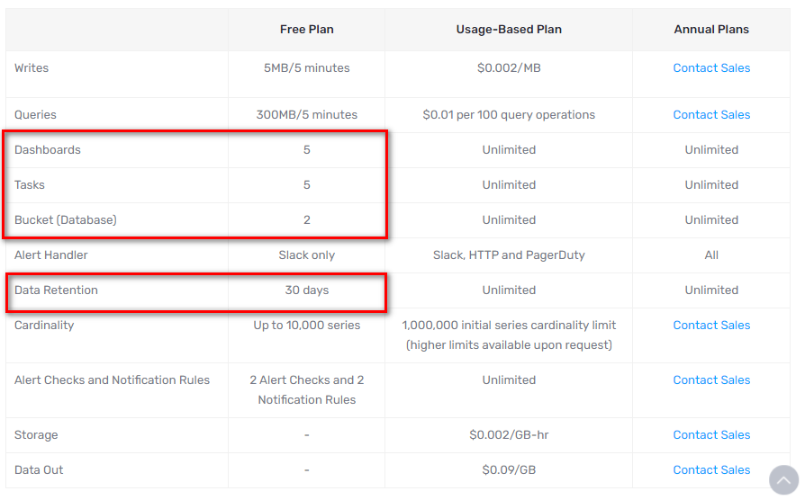

## Instalación y Configuración de InfluxDB

[InfluxDB](https://www.influxdata.com/) es una base de datos de series temporales de código abierto (TSDB) desarrollada por InfluxData. Está escrito en Go y optimizado para el almacenamiento y la recuperación rápidos y de alta disponibilidad de datos de series temporales en campos como el monitoreo de operaciones, aplicaciones de medición, datos de sensores de Internet de las cosas y análisis en tiempo real.  InfluxDB puede recibir datos de diferentes gestionándolos en bases de datos.

Aunque acaban de sacar una versión online (InfluxDB 2.0), disponible como **servicio en la nube,** con interfaz de usuario basada en la web para registrar y visualizar los datos, sin necesidad de un programa visualizador. Tiene limitaciones respecto al número de dashboards que se pueden hacer y el número de sensores aparte que todos los datos están en servidores externos.



Como podemos apreciar tiene límite de retención de datos de 30 días, una vez pasados se borran los datos. Se pueden visualizar hasta 5 dashboards y con un límite de 5-10 sensores. Por eso que preferimos utilizar la **v1.8.3** para operar con mayor libertad y control sobre los datos.

### Instalación de InfluxDB

En Ubuntu 20.04 añadimos al repositorio InfluxDB a nuestro sistema, ya que así las actualizaciones son más sencillas.

```
wget -qO- https://repos.influxdata.com/influxdb.key | sudo apt-key add -
source /etc/lsb-release
echo "deb https://repos.influxdata.com/${DISTRIB_ID,,} ${DISTRIB_CODENAME} stable" | sudo tee /etc/apt/sources.list.d/influxdb.list
```

Ahora actualizamos nuestra paquetería e instalamos InfluxDB

```
sudo apt-get update
sudo apt-get install influxdb
sudo service influxdb start
```

Comprobamos que todo va bien con el siguiente comando

```
sudo systemctl status influxdb
```


### Configuración de InfluxDB

InfluxDB es una BBDD de serie temporal compatible con SQL así que podemos configurar una base de datos y usuario de manera muy sencilla.

Iniciamos el Shell de Influx escribiendo lo siguiente:

```
influx
```

El primer paso consiste en crear una base de datos que la llamaremos “**telegraf**”:

```
CREATE DATABASE telegraf
```

Se puede ver la base de datos creada mediante

```
SHOW DATABASES
```

### Crear usuario en InfluxDB

Continuando dentro influx, crearemos un usuario también llamado “**telegraf**” y le daremos todo los permisos a la base de datos:

```
CREATE RETENTION POLICY thirty_days ON telegraf DURATION 30d REPLICATION 1 DEFAULT
SHOW RETENTION POLICIES ON telegraf
```

Y salimos de INFLUX con el siguiente comando:

```
exit
```

Pasa al [siguiente paso Telegraf](.Telegraf.md)