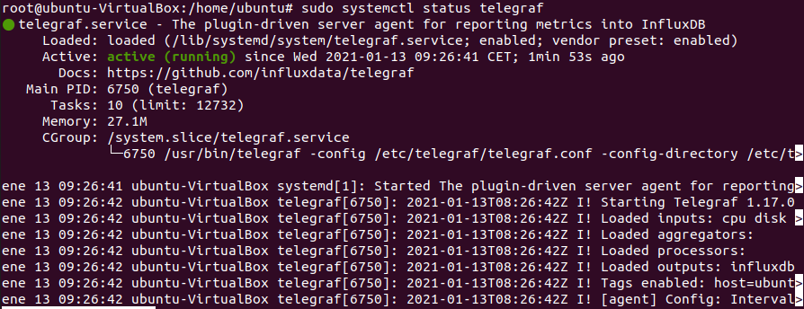
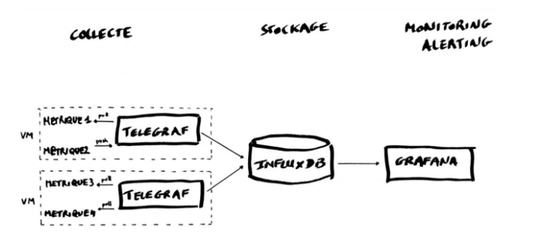

## Instalación y configuración de Telegraf

Mediante un fichero de configuración Telegraf recolecta los datos y los envia a InfluxDB.

Primeramente, tenemos que realizar la instalación del Agente de Servidor (Telegraf), el cual es controlado por complementos con el fin de recopilar e informar métricas para su administración.

Telegraf es altamente escalable gracias a las integraciones que nos permite acceder a métricas, eventos y registros directamente de los contenedores y sistemas en los cuales se está ejecutando la utilidad. A partir de aquí se pueden extraer métricas de API de terceros o también acceder a métricas de los servicios consumidor de StatsD y Kafka. Además cuenta con complementos de salida para enviar métricas hacia otras bases o servicios como InfluxDB (nuestro caso), Graphite, OpenTSDB, Datadog, Librato, MQTT, NSQ y muchos más.

Puesto que Telegraf ha sido creado por influxdata, la cual creó también influxdb; cuando se agregó el repositorio de influxdata anteriormente, es posible instalar ambas aplicaciones.

Es por ello que ejecutando la siguiente línea tendremos instalado Telegraf:

```
sudo apt install telegraf -y
```

Ahora vamos a iniciar el servicio de telegrafía y habilitarlo para que se inicie cada vez que se inicie Ubuntu:

```
sudo systemctl start telegraf

sudo systemctl enable telegraf
```

Para comprobar su estado ejecutamos la siguiente línea y podemos ver que su estado es activo y ejecutándose:

```
sudo systemctl status telegraf
```






Tenemos que configurar la instancia de Telegraf para que lea los datos del servidor TTN (The Things Network). El TTN incluye un bróker MQTT, así que todo lo que tenemos que hacer es lo siguiente.

El servicio de Telegraf coge todas las configuraciones del fichero ubicado en **/etc/telegraf/telegraf.conf**. Al ser un agente basado en complementos éste cuenta con 4 tipos de complementos de concepto que son los siguientes:

\-    [Input Plugins:](https://github.com/influxdata/telegraf#input-plugins) recolecta métricas del sistema, servicios, dispositivos IOT, etc.

\-    [Processor Plugins:](https://github.com/influxdata/telegraf#processor-plugins) Transforma, procesa, decora y filtra las métricas

\-    [Aggregator Plugins:](https://github.com/influxdata/telegraf#aggregator-plugins) Crea conjuntos de métricas, por ejemplo permite hacer una media, conseguir mínimos y máximos partiendo de datos, etc.

\-    [Output Plugins:](https://github.com/influxdata/telegraf#output-plugins) Escribe las métricas a diferentes destinos, en mi caso a InfluxDB.

En nuestro caso los apartados que modificamos son las de Input Plugins y Output Plugins. Es mejor no modificar el archivo original del **telegraf.conf (**[**https://github.com/influxdata/telegraf/blob/master/etc/telegraf.conf**](https://github.com/influxdata/telegraf/blob/master/etc/telegraf.conf)**).** Realizamos una copia donde guardaremos la configuración original:

```
cd /etc/telegraf/
sudo mv telegraf.conf telegraf.conf.old
```

Ahora creamos un fichero con el nombre de **telegraf.conf** en el mismo directorio y lo editamos para ponerlo a nuestro gusto con el siguiente comando:

```
nano /etc/telegraf/telegraf.conf
```

para que desde el servidor de TTN (The Things Network) leamos los datos del nodo en cuestión. Por suerte TTN corre un simple bróker MQTT, así que lo único que tenemos que hacer es pegar lo siguiente:

```
[agent]

  flush_interval = "15s"
  interval = "15s"

[[inputs.mqtt_consumer]]

  servers = ["tcp://eu.thethings.network:1883"]
  qos = 0
  connection_timeout = "30s"
  topics = [ "+/devices/+/up" ]
  client_id = "ttn"
  username = "XXX"
  password = "ttn-account-XXX"
  data_format = "json"

[[outputs.influxdb]]

  database = "telegraf"
  urls = [ "http://localhost:8086" ]
  username = "telegraf"
  password = "superpa$$word"

```

En este archivo sustituiremos los siguientes valores: “username” y “password” por los valores que obtenemos del TTN.


Después de cambiar el archivo hay que **reiniciar Telegraf** para que empiece a recoger las métricas y éstas sean enviadas a InfluxDB:

```
service telegraf restart
```

Para ver si los datos son enviados desde Telegraf a InfluxDB debemos de entrar en influxdb con el siguiente comando:

```
influx
```

Y después, utilizando el lenguaje de consulta InfluxQL y la base de datos antes configurada “telegraf”:

```
use telegraf
select * from "mqtt_consumer"
```

Deberías de poder ver algo como lo siguiente, cogiendo como ejemplo la aplicación de “dragino” que mide la **temperatura_exterior**, **temperatura_interior** y la **humedad**:


Los datos vistos en el TTN, después de pasar el decoder al Formato del Payload:


Vemos que los datos son los mismo que han sido leídos por Telegraf y se han guardado correctamente en InfluxDb.

Pasa al [siguiente paso Grafana](./Grafana.md)